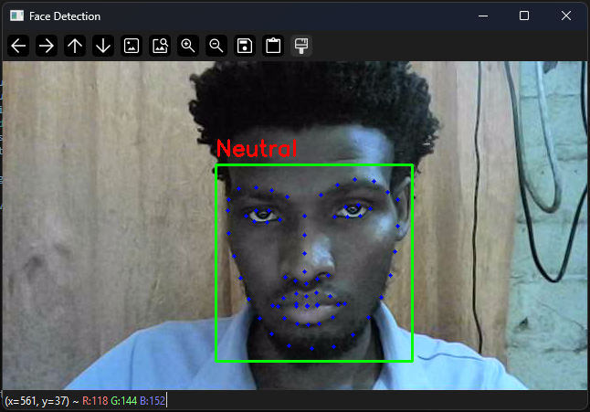
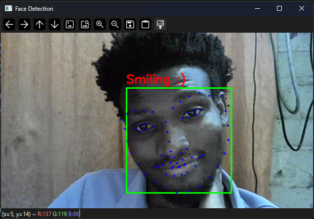

# Real-Time Face Detection

This project captures video from your camera, detects human faces in real time using Dlib’s frontal face detector, identifies facial landmarks, and computes a smile ratio to determine whether the person is smiling.

## Author

Radithole Maripa

## Features
- Real-time face detection
- 68-point facial landmark detection
- Smile detection using geometric ratio
- Facial landmark visualization
- Works with OpenCV + Dlib

## System Requirements

To build and run this project on Windows, you must have the following installed:
- **MinGW-w64** (64-bit GCC compiler for Windows)  
- **OpenCV** (precompiled or compiled for Windows)  
- **Dlib** (C++ library for machine learning and computer vision) 
- shape_predictor_68_face_landmarks.dat (included in the repository) 

> Note: OpenCV uses BSD 3-Clause License, Dlib uses Boost Software License.  
> If redistributing their binaries or source, include the respective license notices.

## Required Files
- **shape_preditor_68_face_landmarks.dat** - Dlib's facial landmark predictor model.
This file is required for detecting key facial points (eyes, nose, mouth. jawline) 
after a face is detected.

## Build on Windows

> Important: Update the paths in the `Makefile` to match where OpenCV and Dlib are installed on your system.  
> Example lines in `Makefile` (replace with your paths):

```make
OPENCV_DIR := C:/path/to/your/opencv
DLIB_DIR := C:/path/to/your/dlib
```

1. Open **Command Prompt** in the project folder.
2. Run:
```make
mingw32-make
```
- This will compile the source files and create the executable FaceDetect.exe.

3. To clean build artifacts:
```make
mingw32-make clean
```

## Run Instructions
1. Ensure the **face predictor model file(shape_predictor_68_face_landmarks.dat)** 
is in the same directory as the executable or update the path in your code.
2. In the Command Line, run:
```make
FaceDetect
```
- A Window opens showing the camera feed.
- Green rectangles show detected faces.
- Blue points show facial landmarks.
- Text above the face shows the smile status.
- Press q to quit the program.

## Smile Detection (Using Facial Landmarks)
The program detects smiles by comparing the width of the mouth to the height of the mouth.
These values come from the Dlib's 68-point landmark model

## Landmark Points Used
- Point 48 - Left mouth corner
- Point 54 - Right mouth corner
- Point 51 - Top of upper lip
- Point 57 - Bottom of lower lip
Coordinates:
- Left: (x48, y48)
- Right: (x54, y54)
- Top: (x51, y51)
- Bottom: (x57, y57)

## Mouth Width
```make
mouthWidth = sqrt( (x54 - x48)^2 + (y54 - y48)^2 )
```
## Mouth Height
```make
mouthHeight = sqrt( (x57 - x51)^2 + (y57 - y51)^2 )
```
## Smile Ratio
```make
smileRatio = mouthWidth / mouthHeight
```
Smiling increases the horizontal width of the mouth more than the vertical height.
## Interpretation
This depends on lighting and camera quality:
- Neutral: around 2.0 to 3.0
- Smiling: greater than 3.1 to 4.0
On the camera currently being used for this project, a threshold between 3.15 and 3.6 gives accurate results.
## Example Output
Add your own images inside a folder named images/.


